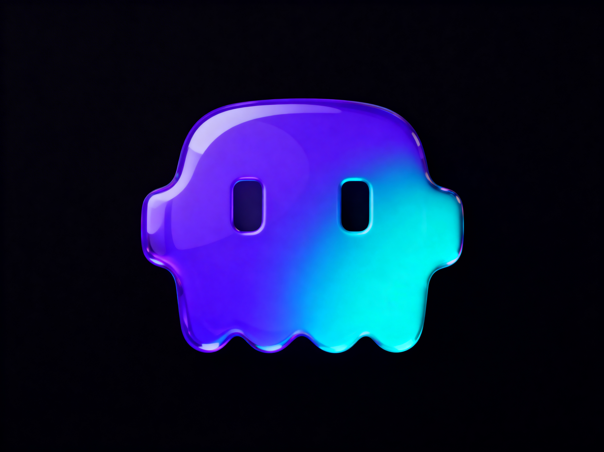

<div align="center">
  

  # AutoClawd

  **Ambient AI for macOS — hears, understands, acts.**

  [](https://www.apple.com/macos/)
  [](https://swift.org)
  [](https://ollama.ai)
  [](LICENSE)

  ~90 source files &nbsp;·&nbsp; ~20K lines of Swift &nbsp;·&nbsp; entirely self-built with Claude Code

</div>

---

AutoClawd is a macOS app that runs as a floating pill widget and menu bar icon with an always-on microphone. It listens to your conversations, watches your screen via OCR, understands what you're working on, and autonomously executes tasks — all without you ever typing a prompt.

You talk. It handles the rest.

Everything runs locally on your machine — Apple SFSpeechRecognizer for transcription, Ollama Llama 3.2 for intelligence. **Nothing leaves your device unless you explicitly opt in.**

---

## The Idea

> *"What if AI ran alongside you instead of waiting for you to open it?"*

The AI adoption gap isn't intelligence — it's friction. Every interaction starts with you: opening an app, writing a prompt, describing what you need. Context switching. Trial and error.

AutoClawd removes all of that. It's not a chat interface. It's ambient infrastructure that runs alongside you — recognising what needs doing and doing it, reducing the cognitive overhead of using AI to zero.

**You never give it a prompt. You just work.**

---

## Three Modes

AutoClawd operates through three pill modes, switchable via keyboard shortcuts:

| Mode | Tag | What it does |
|---|---|---|
| **Ambient** | `[AMB]` | Full pipeline — mic → transcribe → analyze → extract tasks → execute autonomously |
| **AI Search** | `[SRC]` | Voice-triggered Q&A against your accumulated context and world model |
| **Learn** | `[LRN]` | FUCBC mode — watches screen + voice, builds reusable capabilities |

The session transcript persists across mode switches. Only 10 seconds of silence or an explicit clear resets it.

---

## Pipeline

Every spoken word flows through a four-stage local intelligence pipeline:

```
Microphone
  |
  +-- Live streaming ---- SFSpeechRecognizer word-by-word partials (appears instantly)
  |
  +-- 30s committed chunk -- Apple SFSpeech or Groq Whisper
  |
  +-- Stage 1: Cleaning ---- Ollama Llama 3.2 -- merge chunks, remove noise,
  |                          resolve speakers, session context enrichment
  |
  +-- Stage 2: Analysis ---- Ollama Llama 3.2 -- extract tasks, tag people,
  |                          identify decisions, update world model
  |
  +-- Stage 3: Task Creation -- classify: auto / ask / captured
  |                             frame titles from project README/CLAUDE.md
  |
  +-- Stage 4: Execution ---- Claude Code SDK -- stream output in project folder
```

Pipeline routing depends on the source:

| Source | Stages run |
|---|---|
| Ambient | clean → analyze → task → execute |
| WhatsApp | full pipeline + auto-reply |

---

## Screen Intelligence

AutoClawd continuously watches your screen via OCR and accessibility tree analysis. It detects:

- **Active app** and window title
- **URLs** in the browser
- **On-screen text** via OCR

This context feeds the capability suggestion system — when AutoClawd recognises you're doing something it can automate, it surfaces a toast notification: the workflow name, the apps involved, and a single tap to start.

---

## Skills, Capabilities, and Workflows

AutoClawd's automation system is built in three tiers:

| Tier | Name | Definition |
|------|------|------------|
| **1** | **Skill** | Atomic. Often just Claude alone, or a single CLI tool. (`yt-dlp`, `video2ai`, "write a tweet thread") |
| **2** | **Capability** | Skill(s) + tool access. Built by FUCBC from what it observes you doing. ("Post to all platforms", "Ingest reference video") |
| **3** | **Workflow** | Ordered sequence of Capabilities that delivers a real output. ("Launch Video", "Podcast to Blog Post") |

**FUCBC (Find Use-Case, Build Capability)** watches your screen and voice in Learn Mode. Every 5 seconds it captures a snapshot: what app is open, what URLs you're visiting, what you said. When it has enough context, it sends the full story to Claude Code — which writes an executable `SKILL.md`, creates a `Capability`, and saves it to your Agents panel.

**My Agents panel** — a grid of all capabilities AutoClawd has built. One click runs any of them. New agents appear automatically as FUCBC discovers new workflows.

**Capability toast** — when OCR detects you're doing something you've already automated, a glass notification appears in the top-right corner with the workflow name and a tap to run it.

**Skills come from GitHub.** When FUCBC encounters an unfamiliar tool, it web-searches for it, fetches the README, understands its CLI interface, and writes a `SKILL.md` automatically.

**144+ built-in skills** ship with AutoClawd — development, analysis, communication, creative, marketing, automation, and more. Custom skills are stored in `~/.autoclawd/openclaw-skills/{slug}/SKILL.md`.

---

## Autonomous Execution

Tasks extracted from your conversations are classified into three modes:

| Mode | Behaviour |
|---|---|
| **Auto** | Executed immediately by Claude Code — no approval needed |
| **Ask** | Shown in the approval queue — you confirm or dismiss |
| **User** | Captured for reference — never auto-executed |

What qualifies as `auto` is fully configurable. You define plain-English rules like *"Send emails"*, *"Create GitHub issues"*, *"Update documentation"* — the analysis LLM uses these when assigning task modes.

Tasks run in the correct project directory with streamed output. An embedded MCP server lets Claude Code read and write AutoClawd data mid-task.

---

## World Model

AutoClawd builds a persistent, per-project knowledge base from every conversation. Facts, decisions, people, and context compound over time into a markdown world model stored locally.

The world model is visualized as an interactive force-directed graph — nodes for people, projects, decisions, and facts, connected by the relationships extracted from your transcripts.

This context feeds back into the pipeline: when AutoClawd analyses a new transcript, it has the full history of what you've discussed about that project.

---

## Context Awareness

AutoClawd weaves ambient context from multiple sources into every pipeline run:

- **Screen** — OCR + accessibility tree analysis of active app, URLs, on-screen text
- **People** — identifies who you mention, tracks them across sessions
- **Location** — Core Location + WiFi SSID; sessions are tied to places for recall
- **Now Playing** — ShazamKit identifies music in the background
- **Clipboard** — monitors changes and weaves copied content into the context graph
- **Structured extraction** — facts, decisions, action items, and entities pulled from every transcript

---

## Install

```bash
# 1. Install Ollama and pull the local model
brew install ollama && ollama pull llama3.2:3b

# 2. Clone and build
git clone https://github.com/sameeeeeeep/autoclawd.git
cd autoclawd && make

# 3. Run
open build/AutoClawd.app

# Or build + run in one step
make run
```

First launch walks through mic and accessibility permissions.

**Optional extras:**

| Feature | Setup |
|---|---|
| Groq transcription (faster, cloud) | Set `GROQ_API_KEY` in `~/.zshenv` or Settings |
| Claude Code execution | Set `ANTHROPIC_API_KEY` in `~/.zshenv` or Settings |
| WhatsApp self-chat | `cd WhatsAppSidecar && npm install && npm start` |
| DMG packaging | `make dmg` |

---

## Keyboard Shortcuts

| Shortcut | Action |
|---|---|
| `^Z` | Toggle microphone |
| `^A` | Ambient Intelligence mode |
| `^S` | AI Search mode |

---

## Architecture

```
AutoClawd.app (Swift / SwiftUI / AppKit)
|
+-- Windows
|     +-- PillWindow (NSPanel)          floating widget, always on top, snap-to-edge
|     +-- MainPanelWindow               dashboard -- agents, pipeline, world model, settings
|     +-- ToastWindow                   capability suggestion toasts (top-right glass card)
|     +-- SetupWindow                   first-run dependency wizard
|
+-- Menu Bar
|     +-- NSStatusBarButton             primary entry point -- click to toggle pill/panel
|
+-- Audio
|     +-- AudioRecorder                 always-on AVAudioEngine (stays hot between chunks)
|     +-- StreamingLocalTranscriber     live SFSpeech word-by-word partials
|     +-- ChunkManager                 30s buffer cycles, session lifecycle
|
+-- Pipeline (serial job queue, 1.5s stagger)
|     +-- TranscriptCleaningService    Ollama Llama 3.2 -- merge, denoise
|     +-- TranscriptAnalysisService    Ollama Llama 3.2 -- tasks, tags, world model
|     +-- TaskCreationService          structured tasks with mode assignment
|     +-- TaskExecutionService         Claude Code SDK streaming
|
+-- Intelligence
|     +-- WorldModelService            per-project markdown knowledge base
|     +-- WorldModelGraph              force-directed graph visualization
|     +-- ExtractionService            facts, decisions, entities
|     +-- PeopleTaggingService         person tracking across sessions
|
+-- Screen Context
|     +-- ScreenVisionAnalyzer         OCR + accessibility tree analysis
|     +-- ScreenshotService            periodic ambient screen capture
|     +-- ClipboardMonitor             clipboard change monitoring
|
+-- FUCBC (Learn Mode)
|     +-- LearnModeService             5s event capture, story builder, capability builder
|     +-- CapabilityStore              persist capabilities, OCR auto-trigger scoring
|     +-- AgentsView                   "My Agents" grid -- one-click run
|
+-- Integrations
|     +-- WhatsAppPoller/Service       Node.js sidecar, self-chat only
|     +-- MCPServer (port 7892)        screen/cursor/selection/transcript tools
|     +-- ClaudeCodeRunner             low-level SDK streaming client
|     +-- QAService                    AI search against context
```

### Local AI Stack

| Stage | Model | Provider | Purpose |
|---|---|---|---|
| Streaming transcription | SFSpeechRecognizer | Apple (on-device) | Live word-by-word partials |
| Committed chunks | Whisper / SFSpeech | Groq (optional) or Apple | Final chunk text |
| Cleaning + Analysis | Llama 3.2 3B | Ollama (on-device) | All intelligence -- merging, task extraction, world model |
| Task execution | Claude Code | Anthropic API | Autonomous task execution via SDK |

### Storage

Everything lives in `~/.autoclawd/` — SQLite databases and markdown files, fully local.

```
~/.autoclawd/
  world-model.md         per-project knowledge base
  transcripts.db         raw + cleaned transcripts
  pipeline.db            pipeline stage records
  structured_todos.db    task queue with status history
  sessions.db            session timeline + place/project links
  extractions.db         facts, decisions, entities
  qa.db                  Q&A history
  context.db             clipboard + screenshot context
  skills/                individual skill JSON files
  openclaw-skills/       OpenClaw SKILL.md directories
  capabilities/          built capability records (index.json)
```

### UI Stack

- **SwiftUI** for all views inside windows
- **AppKit** (NSPanel/NSWindow) for window management — drag, snap, floating
- **Liquid Glass** design system — `LiquidGlassCard`, `GlassButton`, `GlassChip`, `Glass.textPrimary/Secondary/Tertiary`
- Custom fonts, frosted/solid appearance modes, light/dark/system theming

---

## Roadmap

**Next:**
- [ ] Agent execution in the panel (currently streams on pill widget)
- [ ] Workflow chaining — ordered capability sequences with shared context
- [ ] Workflow input UI — references + context + project at run time
- [ ] Skill discovery — web search + GitHub analysis for unfamiliar tools
- [ ] Pre-built workflow library — Launch Video, Podcast to Blog Post, Bug to PR, etc.

**Longer term:**
- [ ] Journal synthesis — daily, monthly, yearly from world model + episodes
- [ ] Proactive WhatsApp engagement — morning/evening digests, open questions
- [ ] World model v2 — PageRank entity graph, diff.md change log
- [ ] Multi-language transcription
- [ ] Workflow marketplace — share + import community workflows

**Shipped:**
- [x] **FUCBC** — capability learning from observed screen+voice; builds executable SKILL.md via Claude Code
- [x] **My Agents panel** — grid of built capabilities; one-click run
- [x] **Capability toast** — OCR auto-trigger → glass notification in top-right corner
- [x] **144+ OpenClaw skills** — yt-dlp, video2ai, remotion, ffmpeg, gdrive, whatsapp, slack, and more
- [x] **Built-in MCP server** (port 7892) — screen/cursor/selection/transcript tools for Claude Code
- [x] Live word-by-word streaming transcript
- [x] Session-persistent transcript across all modes
- [x] Fully local transcription + analysis (Apple + Ollama)
- [x] Skills system with OpenClaw compatibility
- [x] WhatsApp self-chat integration
- [x] People tagging, location, ShazamKit, clipboard context
- [x] World model graph visualization
- [x] Q&A against transcript context
- [x] Configurable autonomous task rules
- [x] Menu bar icon as primary entry point

---

## License

MIT — build on it, fork it, ship it.
